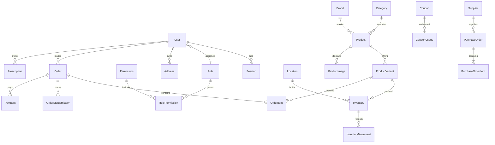

# Bonoful Optics architecture

The web application uses Next.js App Router, React, TypeScript and Tailwind. The retained Sites/Vinext adapter supports the same routes in a Cloudflare Worker. A separate NestJS REST API owns PostgreSQL through Prisma. No browser array, SQLite database or localStorage value is authoritative for commerce.

## Deployment boundaries

The repository root is the frontend; `backend/` is the NestJS application. Next.js production and Docker are supported independently of Sites. The frontend `/api/v1/*` gateway forwards only to `API_URL`, an operator-controlled origin. Sites can host the frontend, but requires an externally reachable HTTPS NestJS backend and PostgreSQL service. There is no pretend database fallback when the API is unavailable.

## Modules and route map

| Domain | API /api/v1 | Frontend |
|---|---|---|
| Identity | auth, users, roles, permissions | /login, /register, /forgot-password, /reset-password, /verify-email |
| Catalog | products, categories, brands, reviews | /shop, /products/[slug] |
| Commerce | cart, wishlist, checkout, orders | /cart, /checkout, /account/orders |
| Optical care | prescriptions, files, appointments | /account/prescriptions, /services |
| Operations | admin, inventory, suppliers, purchase-orders, coupons | /admin/[section] |
| Customer | profile, addresses, notifications | /account/[section] |

Every restricted API checks an opaque server session and database permissions. UI checks improve navigation only. Staff cannot grant themselves roles. Customer queries always include owner IDs. Prescriptions use a dedicated permission and audited access; list and order serializers never include their content.

## Relationships

## Inventory and order invariants

`available = onHand - reserved`; both counters must be nonnegative and reserved cannot exceed onHand. Database CHECK constraints reinforce service validation. Every adjustment, receipt, reservation, release, shipment and return creates a movement with before/after counters, actor and reference. Serializability conflicts are retried with a bounded retry policy.

Checkout runs inside one serializable transaction: read the authoritative cart and prices; validate coupon dates, restrictions and usage; calculate integer minor-unit totals; conditionally reserve inventory; create immutable item/address snapshots, payment record, status history and notification outbox; record coupon usage; clear cart. An idempotency key prevents duplicate checkout orders.

Cancellation releases reservations and coupon usage. Shipping converts reservations into deductions. Refund/restock is an explicit permission-controlled transition from delivered, with a payment-provider record; refund initiation does not falsely mark an external refund settled. Purchase receiving checks remaining quantities and atomically adds stock, receipt counts and movements. Archived variants remain linked to historical orders.

## Security and extension points

Argon2id hashes passwords; opaque random session and single-use reset/verification tokens are stored only as SHA-256 digests. Cookies are HttpOnly, Secure in production and SameSite=Lax. Unsafe requests require allowed Origin plus a session-bound CSRF header. Database rate limits cover auth, uploads and public submissions. AES-256-GCM encrypts prescription values, prescription file bytes and outbound sensitive email payloads. Uploads are bounded, signature checked and never addressed by user paths.

Payments and notifications use adapter boundaries. Cash-on-delivery is the operational payment method; external card processing is disabled until an adapter is configured. SMTP processes an outbox with retries. No card fields are accepted. Location-based inventory, currency snapshots and an outbox make future branches, providers and queues additive changes.

## Verification phases

1. Foundation: TypeScript, Prisma validation and migration deployment.
2. Commerce: API validation, persistent catalog/cart/wishlist, authoritative totals.
3. Orders: concurrency, idempotency, cancellation, reservation and shipment tests.
4. Operations: permission enforcement, receiving and adjustment tests.
5. Optical: owner isolation, encrypted files and values.
6. Final: backend/frontend builds, API integration tests, frontend critical flows, lint, deployment instructions and source archive.
